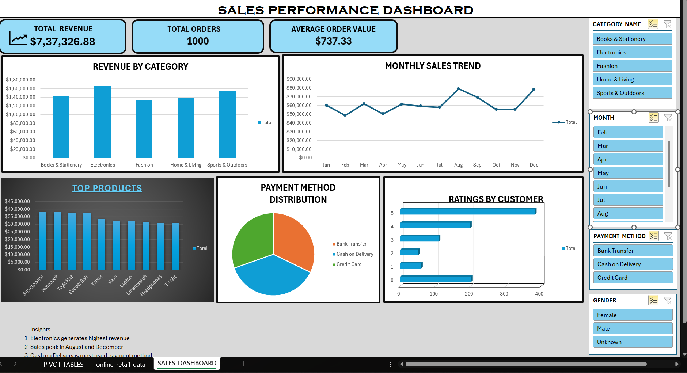

# Sales-performance-dashboard
Excel sales dashboard project
# Sales Performance Dashboard (Excel)

## Project Overview
This project presents an interactive Sales Performance Dashboard built using Microsoft Excel. It analyzes e-commerce sales data to provide insights into revenue trends, product performance, and customer behavior.

##  Objectives
- Analyze monthly sales trends and total revenue
- Identify top-performing products and categories
- Understand customer behavior and payment methods
- Build an interactive dashboard using slicers

##  Tools Used
- Microsoft Excel (Pivot Tables, Charts, Slicers, KPI Cards)

## Key Features
- KPI Cards: Total Revenue, Total Orders, Average Order Value
- Revenue by Category
- Monthly Sales Trend
- Top Products Analysis
- Payment Method Distribution
- Customer Ratings Analysis
- Interactive Filters (Category, Payment Method, Gender)

##  Key Insights
- Electronics category generates the highest revenue
- Sales peak in August and December
- Cash on Delivery is the most used payment method
- Majority of customers gave 5-star ratings

## Files Included
- Sales_dashboard.xlsx → Interactive dashboard
- Sales_data.xlsx → raw and messy dataset
- Dashboard_full.png → Dashboard preview
- Sales_dashboard_case_study.pdf → Detailed case study
